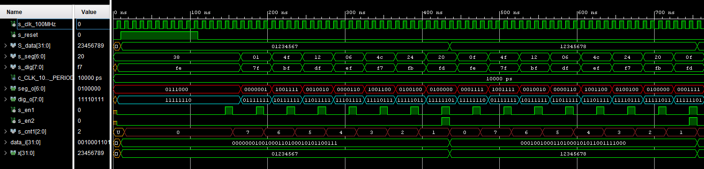

# Běžící text na 7-seg displaji

### Členové týmu

* Member 1 (responsible for xxx)
* Member 2 (responsible for xxx)
* Member 3 (responsible for xxx)
* Member 4 ()

### Obsah

* [Cíl projektu](#objectives)
* [Popis Hardware](#hardware)
* [VHDL popis modulů a simulací](#modules)
* [Popis TOP modulu a simulací](#top)
* [Video](#video)
* [Zdroje](#references)

## Cíl projektu
Cílem projektu je zobrazit na 7-segmentových displejích běžící text.

## Popis Hardware
### Nexys A7-50T
Deska Nexys A7 je kompletní platforma pro vývoj digitálních obvodů. Využívá Artix-7 FPGA.

## VHDL popis modulů a simulací
### 7-seg display driver
Tento modul slouží k zobrazování znaků na displeji. Jako vstup mu slouží 32bit pole (data_i), které mu poskytuje shift_array.
K aktualizaci hodnot jednotlivých displejů dochází postupně a jejich výběr probíhá pomocí 3bit čítače.

Odkaz na kód:

### shift_array
Shift array zajišťuje posouvání znaků v poli.   !!!!dodat simulaci

Odkaz na kód: [shift_array](https://github.com/secretnameis/digital-electronics-1/blob/main/labs/projekt/project_3/project_3.srcs/sources_1/new/shift_array.vhd)
   
   testbench: [tb_shift_array](https://github.com/secretnameis/digital-electronics-1/blob/main/labs/projekt/project_3/project_3.srcs/sim_1/new/tb_shift_array.vhd)

### clock_enable

### cnt_up_down

### hex_7seg
Dekóduje dodané hex_i hodnoty a překládá je na 8bit binární kód (seg_o), který pak buď zapne daný segment (0) nebo vypne (1). 

Odkaz na kód: [hex_7seg](https://github.com/secretnameis/digital-electronics-1/blob/main/labs/projekt/project_3/project_3.srcs/sources_1/new/hex_7seg.vhd)

## Popis TOP modulu a simulací
TOP modul mapuje jednotlivé fyzické displeje s výstupy z driveru.

Odkaz na kód: [top](https://github.com/secretnameis/digital-electronics-1/blob/main/labs/projekt/project_3/project_3.srcs/sources_1/new/top.vhd)

## Video

Write your text here

## Zdroje

1. Moduly z hodin
2. shift array: [youtube.com/watch?v=V6YUEPRc64M](https://www.youtube.com/watch?v=V6YUEPRc64M)
